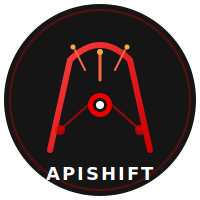
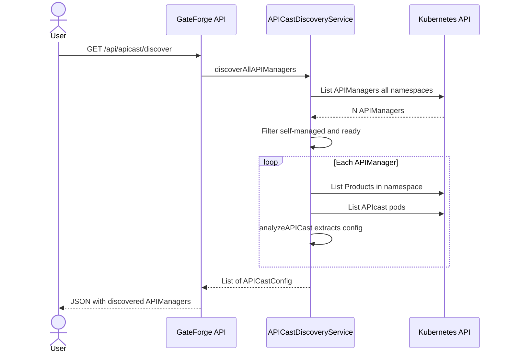
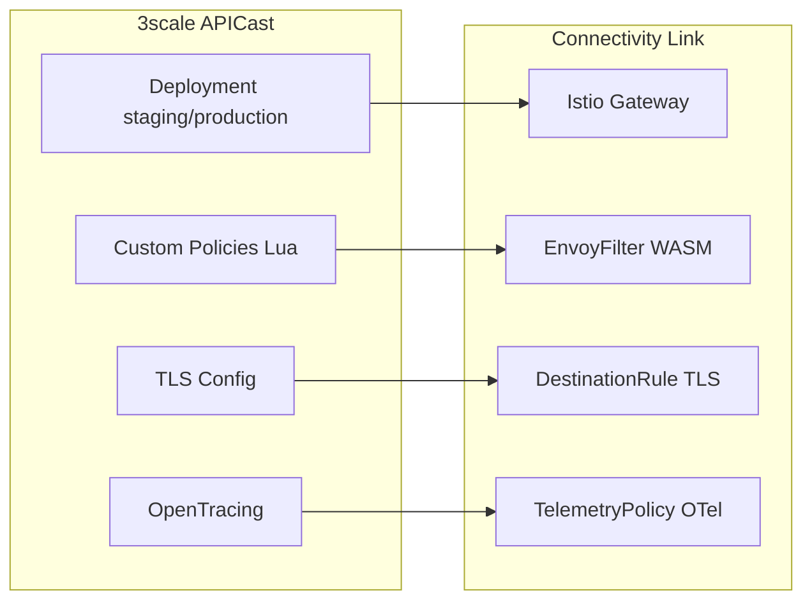

<p align="center">
  
</p>

# GateForge - 3scale to Connectivity Link Migration

**Language:** Documentation and contributions are **English only**. Program policy: [rhcl-ai AGENTS.md — Language policy](https://github.com/Everything-is-Code/rhcl-ai/blob/main/AGENTS.md#language-policy).

[](https://github.com/Everything-is-Code/gateforge/actions/workflows/build-push-quay.yml)
[](https://artifacthub.io/packages/search?repo=gateforge)
[](https://quay.io/repository/maximilianopizarro/gateforge-backend)
[](https://quay.io/repository/maximilianopizarro/gateforge-frontend)
[](https://quay.io/repository/maximilianopizarro/gateforge-devhub-frontend-plugin)
[](https://docs.openshift.com/)
[](https://maximilianopizarro.github.io/gateforge/)

AI-powered migration platform for transitioning from **Red Hat 3scale API Management** to **Red Hat Connectivity Link** (Kuadrant) on OpenShift. Built with **Quarkus** (backend), **Angular** (frontend), **PostgreSQL** (persistence), and **LangChain4j** (AI).

> **v0.1.9** -- APICast self-managed/multi-tenant discovery, 3scale entity conflict resolution, ObservabilityTab/ComponentEditor fixes.

### About this project

> **GateForge** is an independent open-source project licensed under Apache 2.0. It is **not** an official Red Hat product. It integrates with Red Hat 3scale, Red Hat Connectivity Link, and Red Hat Developer Hub but is maintained independently. No commercial support or SLAs are offered at this time.

---

## Architecture Overview

| Layer | Technology | Description |
|-------|-----------|-------------|
| **Frontend** | Angular 18 | SPA served by Nginx (UBI9) |
| **Backend** | Quarkus 3.x, Java 17 | REST API, AI agent, MCP servers, kuadrantctl integration |
| **Persistence** | PostgreSQL 15 | Migration plans, audit trail, federated logs |
| **DB Migrations** | Flyway | Versioned schema evolution (`db/migration/V*.sql`) |
| **AI** | LangChain4j, deepseek-r1-distill-qwen-14b | Migration analysis, resource generation, chat assistant |
| **MCP Servers** | 3scale, Connectivity Link, Kubernetes | Tool calling for AI agent via Model Context Protocol |
| **Migration** | Fabric8 K8s Client | Generate HTTPRoute, AuthPolicy, RateLimitPolicy from 3scale configs |
| **Developer Hub** | GateForge Plugin (backend + frontend) | Observability tabs, Policy Topology, Component editing, catalog enrichment |
| **Packaging** | Helm Chart, Podman Compose | OpenShift deployment + local development |

**Containers:** Backend uses `registry.access.redhat.com/ubi9/openjdk-17`. Frontend uses `registry.access.redhat.com/ubi9/nginx-124`. PostgreSQL uses `registry.redhat.io/rhel9/postgresql-15`.

---

## Policy Mapping & Core Migration Engine

GateForge's foundation is an automated **3scale → Connectivity Link (Kuadrant) translation engine**. Analysis always generates the full resource set; cluster readiness is checked separately at apply time (see [Migration prerequisites](#migration-prerequisites)).

Reference API: `GET /api/migration/policy-mapping` returns the consolidated mapping catalog (same source as this documentation).

### RHCL 1.3 policy taxonomy

| Layer | API group | Resources |
|-------|-----------|-----------|
| **Gateway API** | `gateway.networking.k8s.io/v1` | Gateway, HTTPRoute |
| **Core RHCL** | `kuadrant.io/v1` | AuthPolicy, RateLimitPolicy, TokenRateLimitPolicy, DNSPolicy, TLSPolicy |
| **Extensions** | `extensions.kuadrant.io/v1alpha1` | PlanPolicy, OIDCPolicy, TelemetryPolicy |
| **Developer Portal** | `devportal.kuadrant.io/v1alpha1` | APIProduct, APIKey |
| **Platform** | `v1`, `route.openshift.io/v1` | Secret, Route, Service, ServiceEntry |

> **OIDCPolicy ≠ AuthPolicy JWT** — `OIDCPolicy` orchestrates OAuth Authorization Code (browser) flows. Bearer JWT validation uses `AuthPolicy` with `jwt.issuerUrl`. Token introspection uses `AuthPolicy` with `oauth2Introspection`.

### Consolidated mapping (3scale → RHCL 1.3)

| 3scale | RHCL 1.3 | GateForge today |
|--------|----------|-----------------|
| Product / exposure | Gateway + HTTPRoute + Route | Generated |
| Backend / mapping rules | HTTPRoute.rules + backendRefs | Generated |
| Application (API Key) | Secret + AuthPolicy.apiKey | Generated |
| Application (OIDC) | AuthPolicy.jwt (no Secret) | Generated |
| Application Plan + limits | PlanPolicy (`extensions.kuadrant.io`) | Generated |
| Global / edge limit | RateLimitPolicy (`kuadrant.io`) | Generated (derived from plan limits; placeholder when none) |
| Token-based limit (LLM) | TokenRateLimitPolicy | Suggested only |
| TLS termination | TLSPolicy | Suggested only |
| DNS / multicluster | DNSPolicy | Suggested only |
| Custom metrics labels | TelemetryPolicy | Generated when observability enabled |
| OAuth browser flow | OIDCPolicy | Suggested only |
| API catalog / discovery | APIProduct | Generated when Developer Hub enabled |
| Custom Lua policies | EnvoyFilter / WASM Extension SDK | Manual — no auto-migration |
| Header / URL rewrite | HTTPRoute filters (Gateway API) | Suggested only |

### 3scale APIcast policies → RHCL 1.3

| APIcast policy | RHCL 1.3 target | GateForge |
|----------------|-----------------|-----------|
| API Key | AuthPolicy apiKey + Secret | Generated |
| OIDC (Bearer JWT) | AuthPolicy jwt.issuerUrl | Generated |
| JWT Claim Check | AuthPolicy authorization (patternMatching / OPA) | Suggested |
| OAuth 2.0 Token Introspection | AuthPolicy oauth2Introspection | Partial |
| RH-SSO / Keycloak Role Check | AuthPolicy authorization on JWT claims | Suggested |
| OAuth Authorization Code (browser) | OIDCPolicy extension | Suggested |
| OAuth mTLS / TLS Client Cert | TLSPolicy + AuthPolicy x509 | Suggested |
| Edge Limiting | RateLimitPolicy + PlanPolicy | Partial |
| Custom Metrics | TelemetryPolicy + Envoy/Istio metrics | Partial |
| Web Assembly Plug-In | Envoy WASM / Extension SDK | Manual |
| Auth Caching / Batcher / Referrer | N/A | 3scale-specific |
| CORS, Retry, SOAP, Content Caching | HTTPRoute filters / Istio / WASM | Manual |

### 3scale object mapping (detail)

| 3scale concept | Connectivity Link / Kubernetes resource | Notes |
|----------------|----------------------------------------|-------|
| **Product** | `Gateway` + `HTTPRoute` + `AuthPolicy` + `RateLimitPolicy` + `APIProduct` + `Route` | One bundle per selected product |
| **Backend** | `HTTPRoute.spec.rules[].backendRefs` | Single-backend or multi-backend path routing |
| **Mapping rules** | `HTTPRoute` path/method matches (`PathPrefix`) | Regex `$` anchor removed; `{id}` params normalized |
| **Application plans** | `PlanPolicy` (`extensions.kuadrant.io`) | Per-tier limits + tier predicates |
| **Application keys** (API Key mode) | `Secret` per app (`stringData.api_key` from `user_key`) | `secret.kuadrant.io/plan-id` annotation links plan tier |
| **OIDC applications** | `AuthPolicy` JWT + `PlanPolicy` OIDC predicates | No API key Secrets; tiers match JWT `clientID` |
| **Proxy auth config** | `AuthPolicy` — `apiKey` selector or `jwt.issuerUrl` | API Key and OIDC are **mutually exclusive** per API |
| **Metrics / analytics** | `TelemetryPolicy` (optional) | Labels: product, auth_type, plan, user |
| **External hostname** | OpenShift `Route` (edge TLS) | Points to Istio Gateway service |

### Gateway strategies

| Strategy | Behavior |
|----------|----------|
| **shared** (default) | One `gateforge-shared` Gateway for all products |
| **dual** | Separate internal and external Gateways |
| **dedicated** | One Gateway per product (`{systemName}-gw`) |

### HTTPRoute generation pipeline

1. **Resolve backends** — map 3scale backend usages to cluster Services (by Admin API ID or name).
2. **OpenAPI discovery** — try `/q/openapi`, `/openapi.json`, `/swagger.json`, etc. on the backend URL.
3. **Synthetic OpenAPI** — if no spec is found, build OpenAPI 3.0 from 3scale mapping rules (method + path pairs).
4. **kuadrantctl** — generate `HTTPRoute` from OpenAPI when the product has a single backend.
5. **Fallback templates** — Java-built `HTTPRoute` when kuadrantctl fails or multi-backend routing is required.
6. **Rule consolidation** — Gateway API allows max **16 rules**; excess rules collapse to `PathPrefix` segments (fallback: `/`).

### Authentication mapping

**API Key mode** (`user_key` / `app_id`):

- `AuthPolicy` selects Secrets labeled `app: <productSystemName>` (Authorino-managed).
- Each 3scale application with a `user_key` becomes a dedicated `Secret` preserving the original key value.
- `PlanPolicy` tiers use predicates on `secret.kuadrant.io/plan-id`.

**OIDC mode** (`application_id` / `application_key`):

- `AuthPolicy` uses `jwt.issuerUrl` from 3scale `oidc_issuer_endpoint` (credentials stripped from URL).
- No consumer Secrets are generated.
- `PlanPolicy` tiers match `auth.identity.metadata.annotations["clientID"]` to 3scale `application_id`.
- Clients keep the same IdP, token endpoint, and `Authorization: Bearer` flow.

### Plan & rate-limit mapping

- **Application plan limits** (`minute`, `hour`, `day`, `week`, `month`, `year`) map to `PlanPolicy.spec.plans[].limits` (`daily`, `monthly`, `weekly`, `yearly`, or custom windows).
- A **global** `RateLimitPolicy` is attached to each `HTTPRoute`, derived from the highest application plan `minute` or `hour` limit when available (placeholder 100 req/60s otherwise).
- Custom 3scale metrics (`metricMethodRef`) are reflected in synthetic OpenAPI operation summaries for kuadrantctl.

### Generated resources & apply order

Per product, GateForge may emit (in apply order):

`Gateway` → `HTTPRoute` → `APIProduct` (when Developer Hub enabled) → `PlanPolicy` → `Secret`(s) → `AuthPolicy` → `RateLimitPolicy` → `TelemetryPolicy` → `Route`

Optional `catalog-info.yaml` for Red Hat Developer Hub registration is generated when Developer Hub integration is enabled.

### Migration prerequisites

`POST /api/migration/analyze` returns a `prerequisites[]` list derived from generated resources. These are **required for apply, not for analysis**:

| Prerequisite | Triggered by |
|--------------|--------------|
| Gateway API | `Gateway`, `HTTPRoute` |
| RHCL / Kuadrant core | `AuthPolicy`, `RateLimitPolicy` |
| Kuadrant extensions | `PlanPolicy`, `TelemetryPolicy` |
| Developer Portal | `APIProduct` |
| OpenShift Routes | `Route` |
| Authorino API key secrets | `Secret` with `api_key` |

Use `GET /api/cluster/readiness?planId={id}` to probe CRD/install status on the target cluster before applying.

### Analysis workflow (Migration Wizard)

1. **Select products** — from CRD and/or Admin API discovery (filter, paginate, multi-select).
2. **Choose strategy** — shared / dual / dedicated + optional target cluster.
3. **Analyze** — generates plan, AI pre-migration review, prerequisites, and editable YAML per resource.
4. **Review** — collapsible panels for prerequisites and AI analysis; per-resource YAML edit/toggle.
5. **Apply / Revert** — apply to target cluster or bulk-revert to 3scale with full audit trail.

### Discovery & UI (3scale Explorer)

- Products and backends from **CRD inspection** and **Admin API** (multi-source).
- **Refresh discovery** (`POST /api/threescale/refresh`) evicts cache and reloads live 3scale state.
- Full-page loading overlay blocks navigation during refresh and analysis operations.

---

## Key Features (v0.1.9)

### Phase 1: Multiple 3scale Sources
- Connect to **N 3scale Admin API endpoints** simultaneously
- Products tagged by source cluster (`sourceCluster` field)
- REST API for source management (`/api/threescale/sources`)
- Environment variable `THREESCALE_SOURCES` for JSON array configuration

### Phase 2: Multi-Cluster Deployment
- **Target cluster selector** in Migration Wizard
- Dynamic Fabric8 `KubernetesClient` per target cluster
- **ArgoCD cluster secret auto-discovery** from `openshift-gitops` namespace
- Per-cluster RBAC validation via `SelfSubjectAccessReview`
- REST API for cluster management (`/api/cluster/targets`)

### Phase 4: AI-Powered Analysis
- **Context injection** (not RAG) — live cluster state is injected into each LLM prompt
- **FAQ cache** with Data Grid (24h TTL) — 10 pre-defined prompts warmed at startup
- **kuadrantctl integration** — 5 CLI commands for resource generation and topology
- **Verification** — AI reviews generated resources post-generation for correctness

### Phase 5: Developer Hub Integration
- **Software Template Registration**: Components registered via standard RHDH Software Templates (`gateforge-register-component` / `gateforge-unregister-component`)
- **Observability Tab**: Prometheus/Thanos metrics embedded in RHDH entity pages (request rate, error rate, latency percentiles)
- **Policy Topology Tab**: Kuadrant policy DAG visualization (Gateway → HTTPRoute → policies → APIProduct → APIKey)
- **Component Editor**: Inline editing for platformadmin (no repo required) — annotations, tags, description
- **Pre-registration Editing**: Edit Component definition before catalog registration
- **Catalog Enrichment**: `GateForgeKuadrantProcessor` enriches 3scale API entities with `kuadrant.io/*` annotations

### Phase 6: APICast Discovery and Migration (v0.1.9)
- **APIManager CRD scanning**: Discovers `APIManager` resources cluster-wide via Fabric8 client
- **Self-managed detection**: Filters for APIManagers with `spec.apicast` (self-managed) and `Available` condition
- **Configuration analysis**: Extracts staging/production specs, custom policies, TLS, OpenTracing settings
- **Istio/Connectivity Link mapping**: Maps APICast config to Gateway, EnvoyFilter, DestinationRule, TelemetryPolicy, ServiceEntry
- **Multi-tenant support**: Detects tenant configurations within APIManager CRDs
- **4 test scenarios** in GitOps with Microcks-backed mocks (API Key, OIDC, Multi-Tenant, Custom Policies+TLS)
- **3scale entity deregistration**: Post-migration unregistration of 3scale-discovered entities to prevent catalog conflicts
- **Bug fixes**: ObservabilityTab null guard for metrics, ComponentEditorTab broadened GateForge detection

### Phase 3: Hub-Spoke Architecture
- **PostgreSQL persistence** for migration plans and audit entries (replaces in-memory storage)
- **Flyway migrations** for versioned schema evolution (`src/main/resources/db/migration/`)
- **Federated audit log** with cluster/action filtering (`/api/hub/audit`)
- **Hub overview API** with aggregated stats (`/api/hub/overview`)
- **Topology API** showing all clusters and sources (`/api/hub/topology`)

---

## APICast Discovery Architecture





---

## Prerequisites

**Full migration to Connectivity Link (OpenShift):**

* **OpenShift 4.21** with cluster-admin or least-privilege RBAC
* **3scale Operator** installed (for CRD discovery)
* **Kuadrant Operator** / Connectivity Link installed
* **Helm 3** for deployment

**Local development / discovery-only (no Kuadrant required):**

* **Podman** + **podman-compose**
* **3scale Admin API** URL and access token (inventory and effort estimation via Admin API)
* Optional: **LiteLLM** API key for the AI assistant
* Optional: **OpenShift API** token only if you enable CRD or APICast discovery in `.env`

**Traditional dev (without containers):**

* **Java 17** + **Maven 3.9+** for backend development
* **Node.js 20** for frontend development

---

## Running the Solution

### Local Development

**Backend:**

```bash
cd backend
mvn quarkus:dev
```

**Frontend:**

```bash
cd frontend
npm install
npm start
```

Open **http://localhost:4200**. The Angular dev server proxies `/api` to `http://localhost:8080`.

### Containers (Podman Compose) — recommended for contributors

Local stack uses **public** images (PostgreSQL, Infinispan) — no Red Hat registry login required.

**Requirements:** [Podman](https://podman.io/) and [podman-compose](https://github.com/containers/podman-compose). The first `./scripts/local-up.sh` run builds backend and frontend images and may take several minutes.

**Quick start:**

```bash
cp .env.example .env
# Edit .env: set THREESCALE_ACCESS_TOKEN, AI_API_KEY, and optional KUBE_* for cluster discovery
./scripts/local-up.sh
```

**Stop / reset:**

```bash
./scripts/local-down.sh          # stop containers
podman-compose down -v         # stop and delete DB volume
```

**Endpoints:**

| Service | URL |
|---------|-----|
| UI | http://localhost:4200 |
| API | http://localhost:8080/api |
| Health | http://localhost:8080/q/health/ready |
| 3scale status | http://localhost:8080/api/threescale/status |
| PostgreSQL | localhost:5432 (`gateforge` / `gateforge`) |

**Discovery-only mode (default in compose):** `THREESCALE_CRD_DISCOVERY=false` and `APICAST_DISCOVERY=false` — enough to explore 3scale products/backends via Admin API and run migration **analysis** without Kuadrant or cluster write access. Set both to `true` in `.env` plus `KUBE_*` for CRD/APICast inventory (read-only RBAC is sufficient; cluster-admin is not required).

**Verify:**

```bash
curl -sf http://localhost:8080/q/health/ready
curl -sf http://localhost:8080/api/threescale/status
```

See [.env.example](.env.example) for all variables.

### Helm Chart (OpenShift)

```bash
helm repo add gateforge https://maximilianopizarro.github.io/gateforge/
helm install gateforge gateforge/gateforge \
  --set ai.apiKey=YOUR_KEY \
  --set threescale.adminApi.url=https://3scale-admin.apps.example.com \
  --set threescale.adminApi.accessToken=YOUR_TOKEN \
  --set clusterDomain=apps.cluster.example.com
```

### Multi-Source Configuration

Pass additional 3scale sources as a JSON array:

```bash
helm install gateforge gateforge/gateforge \
  --set threescale.sources='[{"id":"prod","label":"Production 3scale","adminUrl":"https://3scale-admin.prod.example.com","accessToken":"TOKEN","enabled":true}]'
```

### Multi-Cluster Configuration

Add target clusters or enable ArgoCD discovery:

```bash
helm install gateforge gateforge/gateforge \
  --set argocd.clusterDiscovery=true \
  --set targetClusters='[{"id":"staging","label":"Staging Cluster","apiServerUrl":"https://api.staging.example.com:6443","token":"TOKEN","authType":"token","verifySsl":false,"enabled":true}]'
```

---

## API Endpoints

### Core APIs

| Endpoint | Method | Description |
|----------|--------|-------------|
| /api/cluster/projects | GET | List all cluster projects |
| /api/threescale/products | GET | List 3scale Products (all sources, CRD + Admin API) |
| /api/threescale/backends | GET | List 3scale Backends (all sources) |
| /api/threescale/status | GET | Admin API connectivity status |
| /api/threescale/refresh | POST | Evict discovery cache and reload products/backends |
| /api/migration/policy-mapping | GET | Consolidated 3scale → RHCL 1.3 mapping reference |
| /api/migration/analyze | POST | Analyze and plan migration (returns `prerequisites[]`) |
| /api/cluster/readiness | GET | Probe RHCL readiness on target cluster (optional `planId`) |
| /api/migration/plans | GET | List migration plans |
| /api/migration/plans/{id}/apply | POST | Apply plan to target cluster |
| /api/migration/plans/{id}/revert | POST | Revert plan from target cluster |
| /api/migration/revert-bulk | POST | Bulk revert to 3scale |
| /api/audit/reports | GET | View audit log |
| /api/chat | POST | AI migration assistant |

### Multi-Source APIs (Phase 1)

| Endpoint | Method | Description |
|----------|--------|-------------|
| /api/threescale/sources | GET | List all 3scale sources |
| /api/threescale/sources | POST | Add a new 3scale source |
| /api/threescale/sources/{id} | DELETE | Remove a 3scale source |
| /api/threescale/sources/{id}/status | GET | Check source connectivity |

### Multi-Cluster APIs (Phase 2)

| Endpoint | Method | Description |
|----------|--------|-------------|
| /api/cluster/targets | GET | List target clusters |
| /api/cluster/targets | POST | Add a target cluster |
| /api/cluster/targets/{id} | DELETE | Remove a target cluster |
| /api/cluster/targets/{id}/validate | GET | Validate RBAC access on target |

### Developer Hub Integration APIs (Phase 5)

| Endpoint | Method | Description |
|----------|--------|-------------|
| /api/migration/plans/{id}/catalog-info/{product} | GET | Serve generated catalog-info.yaml for catalog:register |
| /api/migration/plans/{id}/confirm-registration | POST | Confirm Component registration (with optional edits) |

### APICast Discovery APIs (Phase 6)

| Endpoint | Method | Description |
|----------|--------|-------------|
| /api/apicast/discover | GET | Discover all APIManagers with self-managed APICast |
| /api/apicast/discover/{namespace} | GET | Discover APIManagers in a specific namespace |
| /api/apicast/analyze/{namespace}/{name} | GET | Analyze specific APIManager configuration |
| /api/apicast/map | POST | Map APICast config to Istio/Connectivity Link resources |
| /api/apicast/map-all | POST | Batch map all discovered APICasts |

### Hub-Spoke APIs (Phase 3)

| Endpoint | Method | Description |
|----------|--------|-------------|
| /api/hub/overview | GET | Aggregated hub stats (plans, clusters, audit) |
| /api/hub/audit | GET | Federated audit log (filter by cluster, action) |
| /api/hub/plans | GET | Federated plans (filter by cluster, status) |
| /api/hub/topology | GET | Cluster + source topology graph |

---

## Helm Chart Values

| Value | Default | Description |
|-------|---------|-------------|
| `backend.image.tag` | v0.1.9 | Backend image tag |
| `frontend.image.tag` | v0.1.9 | Frontend image tag |
| `ai.enabled` | true | Enable AI features |
| `ai.endpoint` | litellm-prod... | LLM endpoint URL |
| `ai.model` | deepseek-r1-distill-qwen-14b | AI model name |
| `ai.apiKey` | "" | LLM API key |
| `threescale.adminApi.url` | "" | 3scale Admin Portal URL |
| `threescale.adminApi.accessToken` | "" | 3scale access token |
| `threescale.sources` | "" | JSON array of additional 3scale sources |
| `targetClusters` | "" | JSON array of target clusters |
| `argocd.clusterDiscovery` | false | Auto-discover clusters from ArgoCD secrets |
| `postgresql.enabled` | true | Deploy PostgreSQL for persistence |
| `postgresql.username` | gateforge | Database username |
| `postgresql.password` | gateforge | Database password |
| `connectivityLink.gatewayStrategy` | shared | shared / dual / dedicated |
| `connectivityLink.gatewayClassName` | istio | Gateway class |
| `rbac.clusterAdmin` | false | Use cluster-admin (dev only) vs least-privilege |
| `developerHub.scaffolderUrl` | "" | RHDH Scaffolder API URL for Component registration |
| `developerHub.scaffolderToken` | "" | Bearer token for Scaffolder API authentication |
| `route.enabled` | true | Create OpenShift Route |

---

## Official Documentation

* [Red Hat Connectivity Link](https://docs.redhat.com/en/documentation/red_hat_connectivity_link)
* [Kuadrant Docs](https://docs.kuadrant.io/)
* [kuadrantctl](https://github.com/Kuadrant/kuadrantctl)
* [3scale API Management](https://docs.redhat.com/en/documentation/red_hat_3scale_api_management)
* [3scale Operator](https://github.com/3scale/3scale-operator)
* [Gateway API](https://gateway-api.sigs.k8s.io/)
* [Quarkus LangChain4j + MCP](https://quarkus.io/blog/quarkus-langchain4j-mcp/)
* [Migration Guide (ONLU)](https://onlu.ch/en/migration-path-from-red-hat-3scale-api-management-to-red-hat-connectivity-link/)

---

## License

[](https://opensource.org/licenses/Apache-2.0)

This software is licensed under the [Apache License 2.0](LICENSE).
