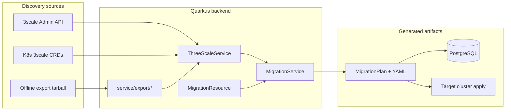

# GateForge architecture

GateForge is a monorepo that migrates **Red Hat 3scale API Management** configurations to **Red Hat Connectivity Link** (Kuadrant) resources on OpenShift. This document maps modules, runtime boundaries, and data flows so contributors can navigate the codebase without reading every large class first.

**Quick path for new contributors**

1. Skim the [repository layout](#repository-layout) table.
2. Follow the [migration data flow](#migration-data-flow) for the core product path.
3. Use [scripts/README.md](../scripts/README.md) for local stack and E2E commands.
4. Read [deferred refactors](#deferred-refactors-out-of-scope-here) before proposing structural changes.

---

## Repository layout

| Path | Role | Runtime |
|------|------|---------|
| `backend/` | Quarkus REST API, migration engine, AI agent, MCP tools | JVM container (`gateforge-backend`) |
| `frontend/` | Angular SPA (dashboard, explorer, wizard, chat, audit) | Nginx container (`gateforge-frontend`) |
| `gateforge-devhub-plugin/` | RHDH backend module — catalog ingestion, migration webhooks | Dynamic plugin sidecar |
| `gateforge-devhub-frontend/` | RHDH frontend plugin — topology, component editor tabs | Dynamic plugin bundle |
| `helm/gateforge/` | OpenShift deployment (backend, frontend, PostgreSQL, Data Grid) | Helm release |
| `scripts/` | Dev, CI, E2E, fixtures, release automation | Host shell / CI |
| `docs/` | GitHub Pages site, screenshots, this file | Published static site |

**Version source of truth:** `helm/gateforge/Chart.yaml` (`version` / `appVersion`). Propagate with `./scripts/release/sync-versions.sh`.

---

## Migration data flow

**Typical paths**

| Entry | Flow |
|-------|------|
| Live discovery | Admin API or in-cluster CRDs → `ThreeScaleService` cache (Data Grid) → wizard selects products → `POST /api/migration/analyze` |
| Offline import | Upload export zip → `ExportImportService` / `ThreeScaleExportParser` → same analyze pipeline |
| Apply | `POST /api/migration/plans/{id}/apply` → Fabric8 client + `kuadrantctl` on target cluster |
| Developer Hub | Plugin receives registration events → catalog entities enriched via `HubResource` |

---

## Backend (`backend/src/main/java/io/gateforge`)

Quarkus 3.x / Java 17. Packages follow a loose layered layout:

| Package | Responsibility |
|---------|----------------|
| `resource/` | JAX-RS REST endpoints (`/api/*`) |
| `service/` | Business logic, K8s integration, 3scale clients |
| `service/export/` | Offline export parse/validate/import — **reference sub-domain** (focused classes, good test coverage) |
| `service/developerhub/` | Developer Hub catalog and scaffolder HTTP client |
| `service/generator/` | Kuadrant/Gateway API YAML builders (Gateway, HTTPRoute, AuthPolicy, PlanPolicy, RateLimitPolicy) |
| `model/` | Immutable records / DTOs shared across layers |
| `entity/` | JPA entities (plans, audit) |
| `repository/` | Panache persistence for migration plans and audit entries |
| `ai/` | LangChain4j migration agent and tool wiring |
| `mcp/` | Model Context Protocol tool definitions |

### REST surface (summary)

| Prefix | Resource | Purpose |
|--------|----------|---------|
| `/api/migration` | `MigrationResource` | Analyze, import-export, plan CRUD, apply/revert, drift |
| `/api/threescale` | `ThreeScaleResource` | Product/backend discovery, sources, refresh |
| `/api/cluster` | `ClusterResource` | OpenShift projects, target clusters, readiness |
| `/api/apicast` | `APICastResource` | APICast discovery and Istio mapping |
| `/api/hub` | `HubResource` | Developer Hub overview, topology, audit |
| `/api/chat` | `ChatResource` | AI assistant |
| `/api/audit` | `AuditResource` | Audit reports |

Persistence: **PostgreSQL** (Flyway migrations in `src/main/resources/db/migration/`). Discovery cache: **Infinispan / Data Grid** (remote Hot Rod client).

### Known concentration points

These classes carry most migration logic today. They work but are hard to review; Phase 2 hardening targets extractions, not rewrites:

| Class | ~LOC | Notes |
|-------|------|-------|
| `MigrationService` | 1400+ | Plan orchestration, apply, DevHub hooks; resource YAML delegated to `service/generator/` |
| `MigrationResource` | 670+ | Large REST surface; DevHub logic moved to `DeveloperHubClient` |
| `service/export/*` | small files | Preferred pattern for new backend code |

---

## Frontend (`frontend/src/app`)

Angular 19 standalone components. Flat layout today (no feature modules yet):

| Path | Route | Role |
|------|-------|------|
| `components/dashboard/` | `/` | Hub overview |
| `components/threescale-explorer/` | `/threescale` | Product/backend browser |
| `components/migration-wizard/` | `/migrate` | Multi-step migration UI |
| `components/chat/` | `/chat` | AI assistant |
| `components/audit-log/` | `/audit` | Audit trail |
| `components/settings/` | `/settings` | Cluster/sources configuration |
| `services/api.service.ts` | — | Single HTTP facade to `/api/*` |

`ng serve` proxies `/api` to `http://localhost:8080` (see `proxy.conf.json`). Production build is static assets behind Nginx.

**Known concentration:** `migration-wizard.component.ts` (~2000 LOC) and `api.service.ts` (~330 LOC). Phase 3 hardening plans feature folders and API facades.

---

## Developer Hub plugins

| Package | Type | Integration |
|---------|------|-------------|
| `gateforge-devhub-plugin` | Backstage backend module | Catalog processor, HTTP router for GateForge events |
| `gateforge-devhub-frontend` | Dynamic frontend plugin | Entity tabs (topology, component editor) |

Packaged as OCI images for RHDH dynamic plugin mounting. Version synced with the Helm chart via `scripts/release/sync-versions.sh`.

---

## Scripts and automation

Organized by purpose under `scripts/`. See **[scripts/README.md](../scripts/README.md)** for the full index.

| Category | Examples |
|----------|----------|
| `dev/` | `./scripts/dev/local-up.sh` — Podman Compose stack |
| `e2e/` | `E2E_MODE=fixture ./scripts/e2e/seed-export-analyze.sh` |
| `ci/` | `./scripts/ci/verify-export-minimal-fixture.sh` |
| `release/` | `./scripts/release/sync-versions.sh` |
| `lib/` | `source scripts/lib/version.sh` (Chart.yaml reader) |

---

## Deployment topology

**Local:** `podman-compose.yml` — backend, frontend, PostgreSQL, optional Data Grid. Requires `.env` from `.env.example`.

**OpenShift:** `helm/gateforge/` chart — configurable image tags, secrets, routes, Data Grid StatefulSet. Published to GitHub Pages Helm repo on release.

---

## Deferred refactors (out of scope here)

Documented for orientation; tracked in architecture-hardening phases 2–3:

| Phase | Target |
|-------|--------|
| 2 — backend | Extract `DeveloperHubClient`, generator strategies, repositories, `ExceptionMapper`, `@QuarkusTest` smoke tests |
| 3 — frontend | `core/`, `shared/`, `features/*` folders; split wizard steps; domain API facades |
| 4 — later | 3scale port abstractions, OpenAPI typegen, E2E in CI |

Do **not** mix large refactors with release or docs-only PRs. Prefer stacked PRs under 400 changed lines when touching god classes.

---

## Related documentation

- [README.md](../README.md) — product overview, policy mapping tables, quick start
- [CONTRIBUTING.md](../CONTRIBUTING.md) — branch workflow, CI, local dev
- [scripts/README.md](../scripts/README.md) — automation index
- [helm/gateforge/README.md](../helm/gateforge/README.md) — chart values and install
